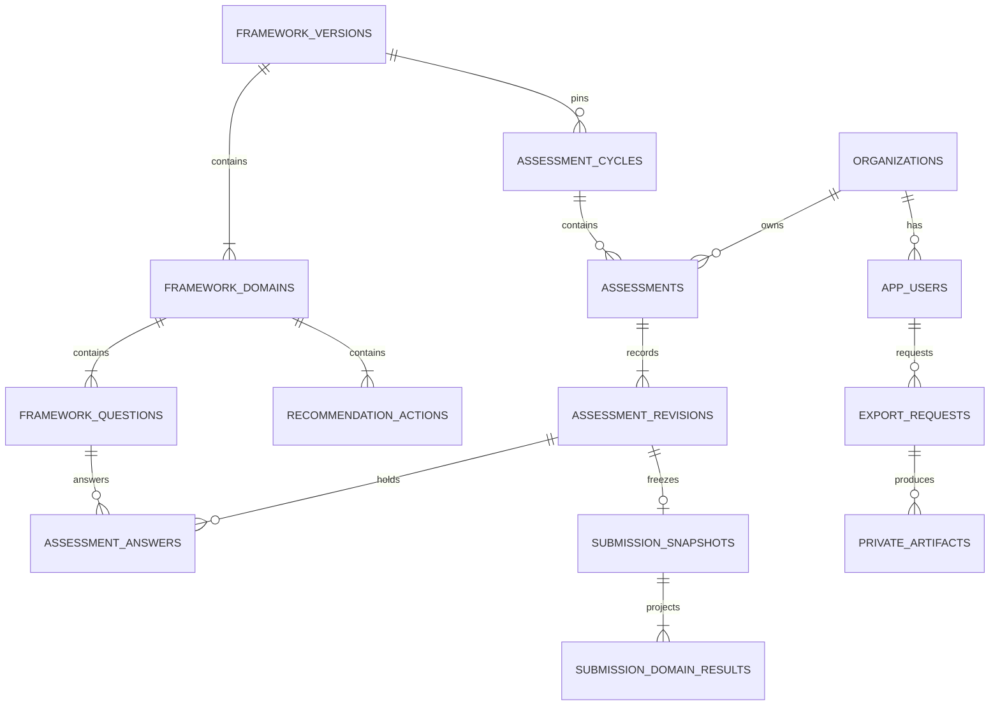

# MySQL schema and domain invariants

**Target:** MySQL 8.4 LTS, InnoDB, strict SQL mode, `utf8mb4`, UTC timestamp storage. Store the cycle's business timezone explicitly. Development and CI integration tests use the same database family; SQLite-only tests cannot prove MySQL constraints or concurrency. This is a proposed schema, not applied migrations.

Business identifiers are server-generated ULIDs (`CHAR(26)` with ASCII binary collation); source question IDs are separate strings. Eloquent models must declare string, non-incrementing keys where used. Passwords and tokens use standard hashes, not recoverable plaintext. Use exact integer Yes counts and decimal display scores rather than floating-point band decisions. [S7]

## Entity map


## Identity and organization tables
| Table | Principal fields | Constraints / rationale |
|---|---|---|
| `organizations` | id, display_name, normalized_name, country_code, size_band, registration_id, normalized_registration_id, authority_confirmed_at/by, active, is_test, timestamps | Index normalized name + country for duplicate review; unique non-null normalized registration within country where reliable. Do not equate every similar name or corporate email domain with the same company |
| `app_users` | id, organization_id nullable, name, normalized email, job_title, password hash, role (`champion/analyst/admin`), can_export, active, email_verified_at, remember_token, MFA state, timestamps | Unique normalized email. One organization context per Champion. Staff are platform-scoped, not arbitrary members of all organizations. Public input never sets privileged fields |
| `staff_invitations` | id, normalized email, role, can_export, token_hash, inviter_id, expires_at, accepted_at, revoked_at | Unique token hash; only admin-issued staff roles; single-use transactional acceptance |
| `email_verification_challenges` | id, app_user_id, challenge_hash, attempts, expires_at, consumed_at, resend controls | No fixed code or plaintext token; rate limit per account and network; invalidate prior challenges |
| `password_reset_tokens` / CMS brokers | framework-defined token storage with separate providers and tables | Do not resolve a CMS email against the application provider or vice versa |
| sessions / MFA recovery state | framework-supported storage | Adapt user identifier width for the actual providers; do not incorrectly force ULIDs into Laravel's default numeric session user field |

Public company registration must never attach a user to an existing company merely because a provided organization ID, company name or email domain matches. Use the authorized registration/onboarding flow; handle suspected duplicates without leaking protected company information. New staff invitations do not grant Champion/tenant membership implicitly. Multiple simultaneous editors or organization self-service membership management are not new scope.

## Versioned framework tables
| Table | Principal fields | Constraints / rationale |
|---|---|---|
| `framework_versions` | id, semantic_version, status, source_file_name, source_sha256, content_sha256, scoring_version, interpretation/config JSON, approval_reference, approved_by/at, published_at | Unique semantic version; immutable after publication; source approval evidence distinct from UX approval |
| `framework_domains` | id, framework_version_id, key, title, position | Unique `(framework_version_id,key)` and `(framework_version_id,position)` |
| `framework_questions` | id, framework_version_id, domain_id, source_question_id, position, text, source_cell | Unique source ID within version; composite FK ensures domain belongs to same version; exact ordered ten questions per domain |
| `recommendation_actions` | id, framework_version_id, domain_id, band, position, text, source_cell | Unique version/domain/band/position; exactly four per band per domain |
| `assessment_cycles` | id, framework_version_id, title, status, opens_at, closes_at, business_timezone | Valid date interval; framework cannot change after any assessment is created; do not infer local demonstration date as real cycle |

The importer validates 4 domains, 40 unique questions, 64 recommendation actions, all bands, exact source IDs, hashes and explicit approval information. Import creates a new draft framework version; publication is a separate audited operation. An ordinary code deploy never updates or republishes existing production content. No edits to a published framework are allowed through generic CRUD.

## Assessment and result tables
| Table | Principal fields | Constraints / rationale |
|---|---|---|
| `assessments` | id, organization_id, cycle_id, framework_version_id, current_submission_id nullable, timestamps | Unique `(organization_id,cycle_id)`; this stable aggregate row is the lock target for revision operations |
| `assessment_revisions` | id, assessment_id, framework_version_id, revision_number, parent_revision_id nullable, status draft/submitted, correction_reason, lock_version, created_by, submitted_by/at, timestamps | Unique `(assessment_id,revision_number)`; at most one open draft via generated nullable unique column; same-parent aggregate constraint |
| `assessment_answers` | revision_id, framework_version_id, question_id, answer nullable 0/1, updated_at | Primary key revision/question; same-version composite FKs; unanswered is null, not zero |
| `submission_snapshots` | revision_id PK, overall_yes_count, overall_percent, band, schema_version, scoring_version, snapshot JSON, canonical_sha256, submitted_at | Exactly one per submitted revision; snapshot contains framework wording/source, company/respondent details, declaration, answers, scores, interpretations and all selected recommendations |
| `submission_domain_results` | revision_id, framework_version_id, domain_id, yes_count, score_percent, band | Unique revision/domain; indexes for portfolio; projection reconciles exactly to immutable snapshot |
| `idempotency_requests` | actor_id, operation, key, request_hash, status, response reference, expiry | Unique actor/operation/key; mismatched request under same key rejected; completed submit retry returns original submission |

No hard delete cascade should erase submitted assessments when an account is disabled. A privacy/retention operation is separately authorized and audited; do not claim that immutable application revisions mean personal data must be kept forever.

### Enforceable constraints
Use genuine MySQL constraints where possible, not only form validation. MySQL does not provide PostgreSQL-style partial unique indexes. A proposed generated-column pattern is:

```sql
open_draft_for CHAR(26) CHARACTER SET ascii COLLATE ascii_bin
  GENERATED ALWAYS AS (CASE WHEN status = 'draft' THEN assessment_id ELSE NULL END) STORED,
UNIQUE KEY uq_one_open_draft (open_draft_for)
```

Add composite candidate keys and FKs so a revision's framework matches its assessment; answers refer to questions in that framework; parent revisions belong to the same assessment; and `current_submission_id` belongs to the same aggregate. The pointer must target a submitted revision with a snapshot; enforce that state invariant in the locked transaction and test it. Do not describe a simple foreign key as proof of a target's status.

Published-child and submitted-answer immutability require tightly scoped services/policies and regression tests, with database privileges/triggers considered where proportionate. A database administrator can still alter storage; do not claim cryptographic tamper-proofing from application checks or a plain hash.

## Atomic operations
### Create/resume draft
Authorize active verified Champion and own company; validate company/declaration and open cycle. Insert-or-find the unique organization/cycle aggregate, then lock it. Reuse its open draft or create revision 1 if permitted. Do not create a second initial assessment after an existing submission. Allocate revision numbers under this lock; never use unlocked `MAX+1`.

### Save answers
Authorize tenant ownership on the server. Lock/check the draft and expected `lock_version`. Validate question IDs against the pinned framework and accept only Yes/No/clear. Reject submitted or stale revisions. Commit answers and increment version; return committed state. A 409 is a conflict, not success. A network retry must not regress state.

### Submit
Use an idempotency key and request hash. In one database transaction, lock aggregate and draft; re-check active identity/organization, role, cycle availability, profile/declaration, state and expected version. Require exactly the 40 framework question IDs, all answered. Compute scores using server code. Create the immutable full snapshot and four domain projections, mark the revision submitted and set the effective pointer. Append audit and outbox events inside the same transaction. Commit before dispatching notifications. A submission retry returns the same result; it never creates another revision.

### Open correction and submit it
Only application Super Admin can authorize a correction, with the approved reason and state rules. Lock the aggregate, prevent a second open draft, copy the effective submission into the next draft and link its parent. Do not modify the old answers/snapshot or effective pointer yet. The Champion edits and submits the correction. Only after its successful commit does the pointer advance. Preserve all previous revisions and the correction authorization event. Explicitly decide correction availability in a closed cycle instead of bypassing date checks accidentally.

### Publish framework / change cycle
Draft framework editing is separate from respondent draft editing. Publish a new complete content version once with approval provenance. Do not mutate a referenced version or cycle framework, even when a new source workbook is deployed. Concurrency tests must prove the lock/constraint behavior rather than relying on single-request UI disablement.

## Reporting, audit and asynchronous tables
| Table | Purpose |
|---|---|
| `audit_events` | Append-only application log of security and domain events, actor, organization, aggregate, outcome and minimal metadata; no passwords/tokens/full answer payloads |
| `outbox_events` | Durable transactional events, attempts and delivery state; idempotent consumers prevent duplicate messages |
| `export_requests` | Requester, exact authorized filters, pinned eligible revision IDs, format, state, timestamps and expiry |
| `private_artifacts` | Private disk/object key, owner/scope, snapshot/release identity, MIME, byte size, checksum, retention/expiry and status |
| Laravel `jobs`, `failed_jobs`, cache/locks, sessions | Standard framework tables adapted to selected versions and identity IDs |

Portfolio aggregates, organizations, comparisons and exports use the **same eligibility service**: latest effective submitted revision per organization for the chosen cycle/framework; exclude drafts and designated test organizations. Historical non-effective submissions remain individually readable only where permitted, not double-counted. Show denominator and filters. Draft participation counts use minimal metadata, not draft answers. Do not mix different frameworks/cycles into a like-for-like comparison.

Freeze export membership at request time and label that time. Reauthorize execution/download against current account and export permission; cancellation/revocation must take effect. A signed or hard-to-guess storage URL alone is not sufficient authorization. Quote/neutralize formula-like spreadsheet values and explicitly type string source IDs. Server-generated files are private and retained only for the documented period.

## Laravel implementation deliverables
Create ordered migrations, matching models/casts, request validation, resources, policies, query scopes and services. Generate `docs/production/schema.sql` from the **tested migrations** in an empty local MySQL instance, rather than treating an unexecuted hand-written SQL file as proof. Provide the generated schema, migration status, ER diagram, indexes, rollback compatibility notes and real concurrency test evidence before Phase 2 sign-off.

Use separate runtime, migration and backup database identities. The ordinary application user cannot drop tables or run migrations. Secrets stay outside Git and images.
