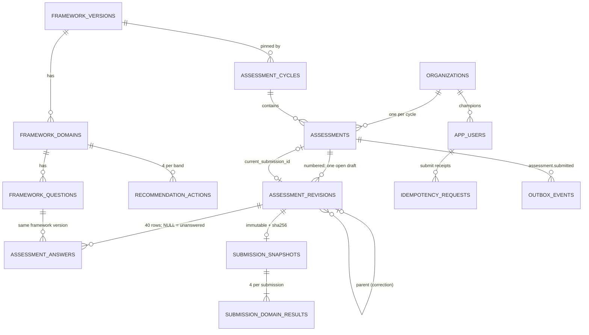

# Phase 2B database diagram

Generated from `docs/production/schema.sql` (structure only). Identity and security tables are Phase 2A.

Database-enforced rules: one assessment per company per cycle (`uq_assessment_org_cycle`); one open draft per assessment (`uq_one_open_draft`, generated column); one open cycle (`uq_one_open_cycle`); unique revision numbers; composite foreign keys keep revisions, answers and results on the assessment's framework version; the current-submission pointer must reference a revision of the same assessment.
